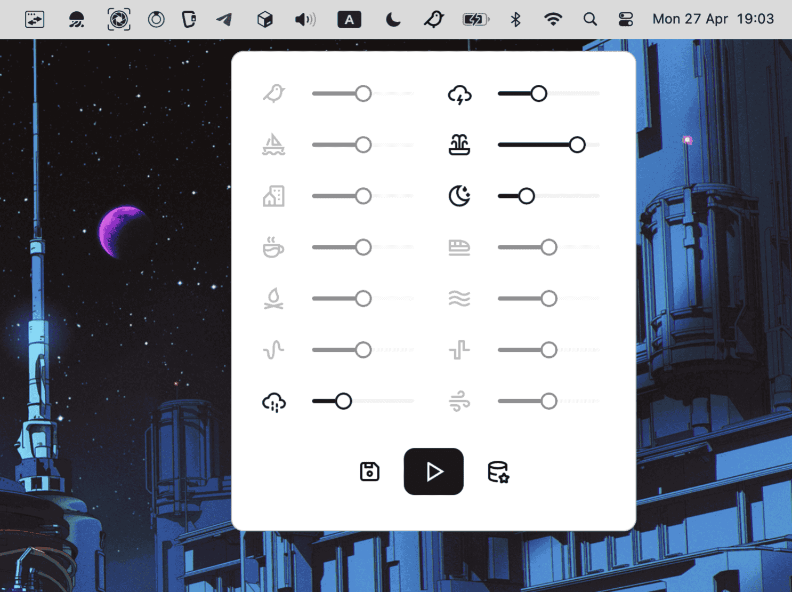

# CozySpace

### Quiet your mind. Amplify your work.

A minimal, distraction-free tray app bringing ambient sounds to your desktop. Perfect for deep work, reading, or meditation.

- **Always Free**: No hidden subscriptions. Core focus sounds are forever free.
- **Open Source**: Built by the community. Inspect the code, contribute, or fork it.
- **Zero Tracking**: Your data stays on your machine. No analytics, no telemetry.

## Features
- supports web and all desktop platforms
- contains 14 ambient sounds with volume control
- make and save your favorite presets
- lives in the tray

## Support the Developer

If you enjoy the project and want to support its development, consider buying me a coffee. Your support helps keep this project free and open-source!

## License

MIT License

Copyright (c) 2026 CozySpace

Permission is hereby granted, free of charge, to any person obtaining a copy
of this software and associated documentation files (the "Software"), to deal
in the Software without restriction, including without limitation the rights
to use, copy, modify, merge, publish, distribute, sublicense, and/or sell
copies of the Software, and to permit persons to whom the Software is
furnished to do so, subject to the following conditions:

The above copyright notice and this permission notice shall be included in all
copies or substantial portions of the Software.

THE SOFTWARE IS PROVIDED "AS IS", WITHOUT WARRANTY OF ANY KIND, EXPRESS OR
IMPLIED, INCLUDING BUT NOT LIMITED TO THE WARRANTIES OF MERCHANTABILITY,
FITNESS FOR A PARTICULAR PURPOSE AND NONINFRINGEMENT. IN NO EVENT SHALL THE
AUTHORS OR COPYRIGHT HOLDERS BE LIABLE FOR ANY CLAIM, DAMAGES OR OTHER
LIABILITY, WHETHER IN AN ACTION OF CONTRACT, TORT OR OTHERWISE, ARISING FROM,
OUT OF OR IN CONNECTION WITH THE SOFTWARE OR THE USE OR OTHER DEALINGS IN THE
SOFTWARE.
